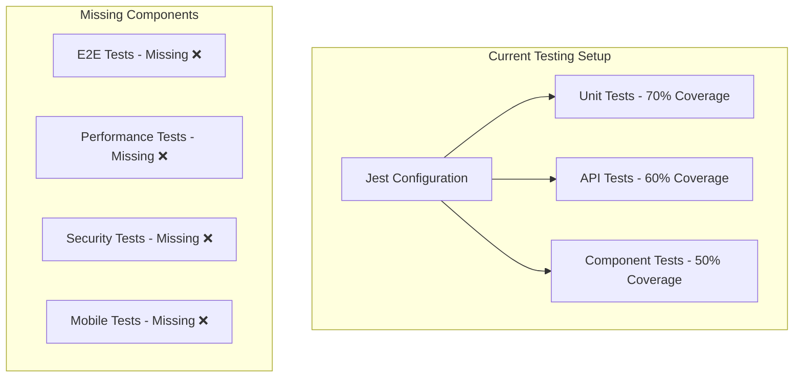

# FriendFinder E2E Test Validation & Production Readiness

## Overview

This document outlines a comprehensive End-to-End (E2E) testing strategy for FriendFinder to validate functionality, ensure production readiness, and verify mobile conversion compatibility. The testing framework validates critical user journeys, API integrations, real-time features, and cross-platform compatibility.

## Current Testing State Analysis

### Existing Test Infrastructure



### Critical Gaps to Address

| Test Type            | Status  | Coverage | Impact   |
| -------------------- | ------- | -------- | -------- |
| E2E Tests            | Missing | 0%       | Critical |
| Performance Tests    | Missing | 0%       | High     |
| Security Tests       | Missing | 0%       | High     |
| Mobile Compatibility | Missing | 0%       | Critical |

## E2E Testing Framework Setup

### Technology Stack: Playwright

```typescript
// playwright.config.ts
import { defineConfig, devices } from "@playwright/test";

export default defineConfig({
  testDir: "./e2e",
  fullyParallel: true,
  retries: process.env.CI ? 2 : 0,
  workers: process.env.CI ? 1 : undefined,
  reporter: [["html"], ["json", { outputFile: "test-results/results.json" }]],
  use: {
    baseURL: "http://localhost:3000",
    trace: "on-first-retry",
    screenshot: "only-on-failure",
  },
  projects: [
    { name: "chromium", use: { ...devices["Desktop Chrome"] } },
    { name: "firefox", use: { ...devices["Desktop Firefox"] } },
    { name: "Mobile Chrome", use: { ...devices["Pixel 5"] } },
    { name: "Mobile Safari", use: { ...devices["iPhone 12"] } },
  ],
  webServer: {
    command: "npm run dev",
    url: "http://127.0.0.1:3000",
    reuseExistingServer: !process.env.CI,
  },
});
```

### Test Data Management

```typescript
// e2e/fixtures/test-data.ts
export const testUsers = {
  user1: {
    email: "test.user1@friendfinder.com",
    password: "TestPassword123!",
    username: "testuser1",
  },
  user2: {
    email: "test.user2@friendfinder.com",
    password: "TestPassword123!",
    username: "testuser2",
  },
};

export const testLocations = {
  newyork: { lat: 40.7128, lng: -74.006 },
  london: { lat: 51.5074, lng: -0.1278 },
};
```

## Critical User Journey Tests

### 1. Authentication Flow Validation

```typescript
// e2e/auth/authentication.spec.ts
test.describe("Authentication Flow", () => {
  test("Complete Registration and Login Journey", async ({ page }) => {
    // Registration
    await page.goto("/register");
    await page.fill('[data-testid="email-input"]', testUsers.user1.email);
    await page.fill('[data-testid="username-input"]', testUsers.user1.username);
    await page.fill('[data-testid="password-input"]', testUsers.user1.password);
    await page.click('[data-testid="register-button"]');

    // Verify redirect to dashboard
    await expect(page).toHaveURL("/dashboard/discover");

    // Logout and login
    await page.click('[data-testid="user-menu"]');
    await page.click('[data-testid="logout-button"]');

    // Login
    await page.fill('[data-testid="email-input"]', testUsers.user1.email);
    await page.fill('[data-testid="password-input"]', testUsers.user1.password);
    await page.click('[data-testid="login-button"]');

    await expect(page).toHaveURL("/dashboard/discover");
  });

  test("Google OAuth Authentication", async ({ page }) => {
    await page.goto("/login");

    // Mock Google OAuth
    await page.route("**/api/auth/signin/google", async (route) => {
      await route.fulfill({
        status: 302,
        headers: { Location: "/dashboard/discover" },
      });
    });

    await page.click('[data-testid="google-login-button"]');
    await expect(page).toHaveURL("/dashboard/discover");
  });
});
```

### 2. Discovery System Validation

```typescript
// e2e/discovery/discovery-flow.spec.ts
test.describe("Discovery System", () => {
  test("GPS Discovery Flow", async ({ page, context }) => {
    await context.grantPermissions(["geolocation"]);
    await context.setGeolocation({ latitude: 40.7128, longitude: -74.006 });

    await loginUser(page, testUsers.user1);
    await page.goto("/dashboard/discover");

    // Select GPS mode
    await page.click('[data-testid="gps-discovery-tab"]');
    await expect(page.locator('[data-testid="google-map"]')).toBeVisible();

    // Trigger discovery
    await page.click('[data-testid="discover-button"]');
    await expect(
      page.locator('[data-testid="discovery-loading"]')
    ).toBeVisible();
    await expect(
      page.locator('[data-testid="nearby-users-list"]')
    ).toBeVisible();
  });

  test("Wi-Fi Discovery Flow", async ({ page }) => {
    await loginUser(page, testUsers.user1);
    await page.goto("/dashboard/discover");

    await page.click('[data-testid="wifi-discovery-tab"]');
    await expect(
      page.locator('[data-testid="wifi-network-info"]')
    ).toBeVisible();

    await page.click('[data-testid="discover-button"]');
    await expect(
      page.locator('[data-testid="nearby-users-list"]')
    ).toBeVisible();
  });
});
```

### 3. Friend Management Validation

```typescript
// e2e/friends/friend-management.spec.ts
test.describe("Friend Management", () => {
  test("Complete Friend Request Workflow", async ({ browser }) => {
    const context1 = await browser.newContext();
    const context2 = await browser.newContext();
    const page1 = await context1.newPage();
    const page2 = await context2.newPage();

    // Login both users
    await loginUser(page1, testUsers.user1);
    await loginUser(page2, testUsers.user2);

    // User 1: Send friend request
    await page1.goto("/dashboard/discover");
    await page1.click('[data-testid="user-card-user2"]');
    await page1.click('[data-testid="send-friend-request"]');
    await expect(
      page1.locator('[data-testid="request-sent-message"]')
    ).toBeVisible();

    // User 2: Accept request
    await page2.goto("/dashboard/friends");
    await page2.click('[data-testid="friend-requests-tab"]');
    await page2
      .locator(
        '[data-testid="friend-request-user1"] [data-testid="accept-request"]'
      )
      .click();

    // Verify friendship
    await page2.click('[data-testid="friends-list-tab"]');
    await expect(page2.locator('[data-testid="friend-user1"]')).toBeVisible();

    await context1.close();
    await context2.close();
  });
});
```

### 4. Real-time Messaging Validation

```typescript
// e2e/messaging/real-time-chat.spec.ts
test.describe("Real-time Messaging", () => {
  test("Two-way Chat Communication", async ({ browser }) => {
    const context1 = await browser.newContext();
    const context2 = await browser.newContext();
    const page1 = await context1.newPage();
    const page2 = await context2.newPage();

    await setupFriendship(page1, page2);

    // Navigate to chat
    await page1.goto("/dashboard/chat");
    await page1.click('[data-testid="conversation-user2"]');
    await page2.goto("/dashboard/chat");
    await page2.click('[data-testid="conversation-user1"]');

    // Send messages
    const message1 = "Hello from User 1!";
    await page1.fill('[data-testid="message-input"]', message1);
    await page1.press('[data-testid="message-input"]', "Enter");

    // Verify real-time delivery
    await expect(page1.locator(`text=${message1}`)).toBeVisible();
    await expect(page2.locator(`text=${message1}`)).toBeVisible();

    // Test typing indicators
    await page1.fill('[data-testid="message-input"]', "Typing...");
    await expect(
      page2.locator('[data-testid="typing-indicator"]')
    ).toBeVisible();

    await context1.close();
    await context2.close();
  });
});
```

### 5. Voice/Video Calling Validation

```typescript
// e2e/calling/webrtc-calls.spec.ts
test.describe("Voice/Video Calling", () => {
  test("Voice Call Flow", async ({ browser }) => {
    const context1 = await browser.newContext();
    const context2 = await browser.newContext();

    await context1.grantPermissions(["camera", "microphone"]);
    await context2.grantPermissions(["camera", "microphone"]);

    const page1 = await context1.newPage();
    const page2 = await context2.newPage();

    await setupFriendship(page1, page2);

    // Initiate call
    await page1.goto("/dashboard/chat");
    await page1.click('[data-testid="conversation-user2"]');
    await page1.click('[data-testid="voice-call-button"]');

    // Verify call states
    await expect(page1.locator('[data-testid="call-modal"]')).toBeVisible();
    await expect(
      page2.locator('[data-testid="incoming-call-modal"]')
    ).toBeVisible();

    // Answer call
    await page2.click('[data-testid="answer-call-button"]');
    await expect(page1.locator('[data-testid="call-connected"]')).toBeVisible();
    await expect(page2.locator('[data-testid="call-connected"]')).toBeVisible();

    // Test controls
    await page1.click('[data-testid="mute-button"]');
    await expect(
      page1.locator('[data-testid="muted-indicator"]')
    ).toBeVisible();

    // End call
    await page1.click('[data-testid="end-call-button"]');
    await expect(page1.locator('[data-testid="call-modal"]')).not.toBeVisible();

    await context1.close();
    await context2.close();
  });
});
```

## Performance Testing

### Load Testing Configuration

```typescript
// e2e/performance/load-tests.spec.ts
test.describe("Performance Tests", () => {
  test("Page Load Performance", async ({ page }) => {
    const startTime = Date.now();
    await page.goto("/dashboard/discover");
    await expect(page.locator('[data-testid="discover-tabs"]')).toBeVisible();

    const loadTime = Date.now() - startTime;
    expect(loadTime).toBeLessThan(3000); // 3 second max
  });

  test("Discovery Performance", async ({ page }) => {
    await loginUser(page, testUsers.user1);
    await page.goto("/dashboard/discover");

    const startTime = Date.now();
    await page.click('[data-testid="discover-button"]');
    await expect(
      page.locator('[data-testid="nearby-users-list"]')
    ).toBeVisible();

    const discoveryTime = Date.now() - startTime;
    expect(discoveryTime).toBeLessThan(5000); // 5 second max
  });

  test("Message Performance", async ({ page }) => {
    await setupChatSession(page);

    const messages = Array.from(
      { length: 10 },
      (_, i) => `Test message ${i + 1}`
    );
    const startTime = Date.now();

    for (const message of messages) {
      await page.fill('[data-testid="message-input"]', message);
      await page.press('[data-testid="message-input"]', "Enter");
      await expect(page.locator(`text=${message}`)).toBeVisible();
    }

    const totalTime = Date.now() - startTime;
    expect(totalTime / messages.length).toBeLessThan(1000); // 1 second per message max
  });
});
```

## Security Testing

### Authentication Security

```typescript
// e2e/security/security-tests.spec.ts
test.describe("Security Tests", () => {
  test("SQL Injection Protection", async ({ request }) => {
    const maliciousPayload = {
      email: "test@test.com'; DROP TABLE users; --",
      password: "password",
    };

    const response = await request.post("/api/auth/callback/credentials", {
      data: maliciousPayload,
    });

    expect([400, 401]).toContain(response.status());
  });

  test("XSS Protection", async ({ page }) => {
    await loginUser(page, testUsers.user1);
    await page.goto("/dashboard/profile");

    const xssPayload = '<script>alert("XSS")</script>';
    await page.fill('[data-testid="bio-input"]', xssPayload);
    await page.click('[data-testid="save-profile"]');

    await page.reload();
    const bioValue = await page.inputValue('[data-testid="bio-input"]');
    expect(bioValue).toBe(xssPayload); // Should be escaped
  });

  test("CSRF Protection", async ({ request }) => {
    const response = await request.post("/api/friends", {
      data: { targetUserId: "user123" },
    });

    expect(response.status()).toBe(401); // Unauthorized without auth
  });
});
```

## Mobile Compatibility Testing

### Responsive Design Validation

```typescript
// e2e/mobile/mobile-tests.spec.ts
test.describe("Mobile Compatibility", () => {
  test("Mobile Navigation", async ({ page }) => {
    await page.setViewportSize({ width: 375, height: 667 });
    await loginUser(page, testUsers.user1);
    await page.goto("/dashboard/discover");

    // Test mobile sidebar
    await page.click('[data-testid="mobile-menu-toggle"]');
    await expect(page.locator('[data-testid="mobile-sidebar"]')).toBeVisible();

    // Test navigation
    await page.click('[data-testid="mobile-nav-friends"]');
    await expect(page).toHaveURL("/dashboard/friends");

    // Verify touch targets (minimum 44px)
    const buttons = page.locator("button");
    const buttonCount = await buttons.count();

    for (let i = 0; i < buttonCount; i++) {
      const button = buttons.nth(i);
      const box = await button.boundingBox();
      if (box) {
        expect(Math.min(box.width, box.height)).toBeGreaterThanOrEqual(44);
      }
    }
  });

  test("Touch Gestures", async ({ page }) => {
    await page.setViewportSize({ width: 375, height: 667 });
    await loginUser(page, testUsers.user1);
    await page.goto("/dashboard/chat");

    const chatContainer = page.locator('[data-testid="chat-container"]');

    // Simulate swipe
    await chatContainer.hover();
    await page.mouse.down();
    await page.mouse.move(100, 0);
    await page.mouse.up();

    await expect(
      page.locator('[data-testid="conversation-list"]')
    ).toBeVisible();
  });

  test("PWA Features", async ({ page, context }) => {
    // Service Worker
    await page.goto("/");
    const swRegistered = await page.evaluate(
      () => "serviceWorker" in navigator
    );
    expect(swRegistered).toBe(true);

    // Offline functionality
    await loginUser(page, testUsers.user1);
    await context.setOffline(true);
    await page.goto("/dashboard/discover");
    await expect(
      page.locator('[data-testid="offline-indicator"]')
    ).toBeVisible();

    await context.setOffline(false);
    await expect(
      page.locator('[data-testid="online-indicator"]')
    ).toBeVisible();
  });
});
```

## Test Execution Strategy

### CI/CD Integration

```yaml
# .github/workflows/e2e-tests.yml
name: E2E Tests
on:
  push:
    branches: [main, develop]
  pull_request:
    branches: [main]

jobs:
  e2e-tests:
    runs-on: ubuntu-latest

    services:
      mongodb:
        image: mongo:6.0
        ports:
          - 27017:27017

    steps:
      - uses: actions/checkout@v3

      - name: Setup Node.js
        uses: actions/setup-node@v3
        with:
          node-version: "18"
          cache: "npm"

      - name: Install dependencies
        run: |
          npm ci
          npx playwright install

      - name: Setup test environment
        run: |
          cp .env.test .env.local
          npm run build

      - name: Run E2E tests
        run: |
          npx playwright test --grep "@smoke"
          npx playwright test --grep "@core"
          npx playwright test --grep "@performance"

      - name: Upload test results
        uses: actions/upload-artifact@v3
        if: always()
        with:
          name: test-results
          path: test-results/
```

## Production Readiness Validation

### Infrastructure Health Checks

```typescript
// e2e/production/health-checks.spec.ts
test.describe("Production Readiness", () => {
  test("Health Check Endpoints", async ({ request }) => {
    const response = await request.get("/api/health");
    expect(response.status()).toBe(200);

    const data = await response.json();
    expect(data.status).toBe("healthy");
    expect(data.database).toBe("connected");
  });

  test("Error Handling", async ({ page }) => {
    // Test 404 pages
    await page.goto("/non-existent-page");
    await expect(page.locator('[data-testid="404-page"]')).toBeVisible();

    // Test API error handling
    await page.route("**/api/friends", (route) =>
      route.fulfill({ status: 500 })
    );
    await loginUser(page, testUsers.user1);
    await page.goto("/dashboard/friends");
    await expect(page.locator('[data-testid="error-message"]')).toBeVisible();
  });

  test("Performance Metrics", async ({ page }) => {
    await page.goto("/dashboard/discover");

    const performanceMetrics = await page.evaluate(() => {
      const navigation = performance.getEntriesByType("navigation")[0];
      return {
        loadTime: navigation.loadEventEnd - navigation.loadEventStart,
        domContentLoaded:
          navigation.domContentLoadedEventEnd -
          navigation.domContentLoadedEventStart,
      };
    });

    expect(performanceMetrics.loadTime).toBeLessThan(2000);
    expect(performanceMetrics.domContentLoaded).toBeLessThan(1000);
  });
});
```

## Implementation Roadmap

### Phase 1: Foundation (Week 1-2)

- Set up Playwright framework
- Implement basic authentication tests
- Create test data management system
- Set up CI/CD pipeline

### Phase 2: Core Features (Week 3-4)

- Discovery system tests
- Friend management tests
- Real-time messaging tests
- Basic mobile compatibility

### Phase 3: Advanced Features (Week 5-6)

- Voice/video calling tests
- Performance testing
- Security testing
- PWA feature validation

### Phase 4: Production Ready (Week 7-8)

- Complete mobile compatibility testing
- Production health checks
- Load testing
- Final validation and documentation

## Success Metrics

### Test Coverage Goals

- **E2E Coverage**: 90% of critical user journeys
- **API Coverage**: 95% of endpoints tested
- **Mobile Coverage**: 100% responsive design validation
- **Performance**: All pages load under 3 seconds
- **Security**: Zero critical vulnerabilities

### Quality Gates

- All smoke tests must pass before deployment
- Performance benchmarks must be met
- Security tests must show no vulnerabilities
- Mobile compatibility score > 95%
- Zero critical bugs in production flows
