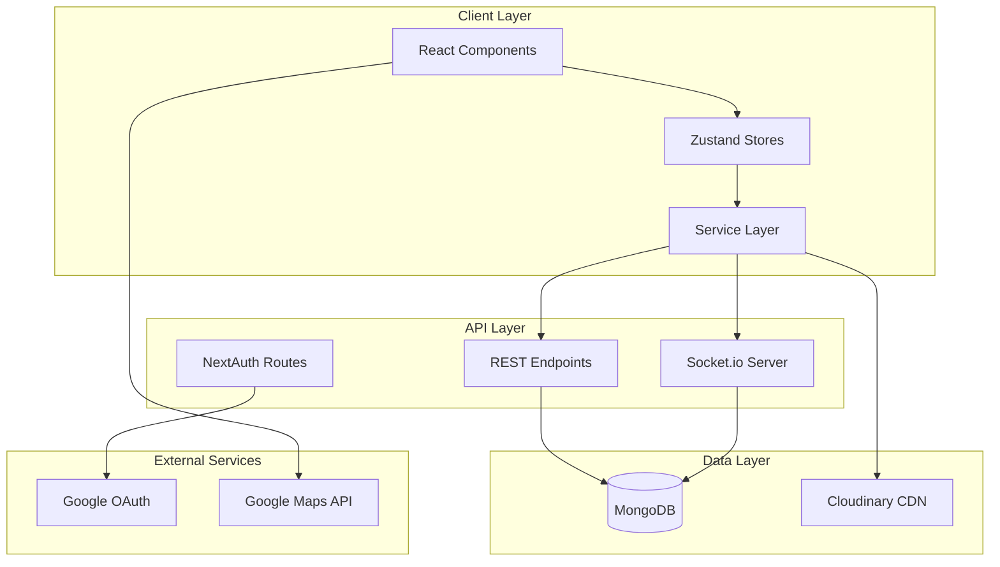
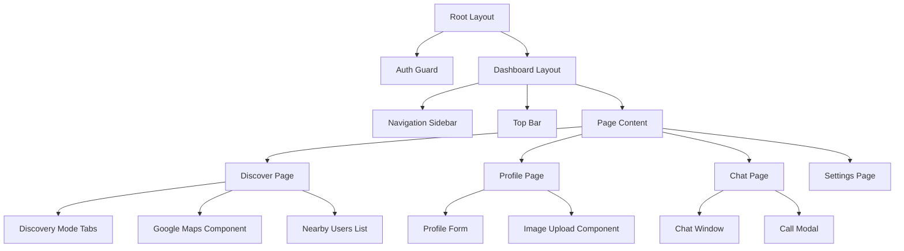
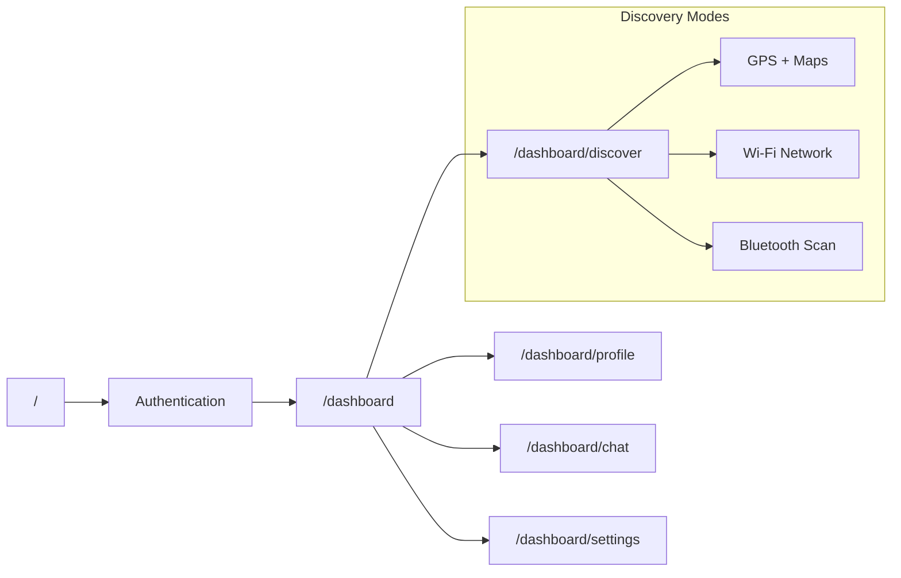
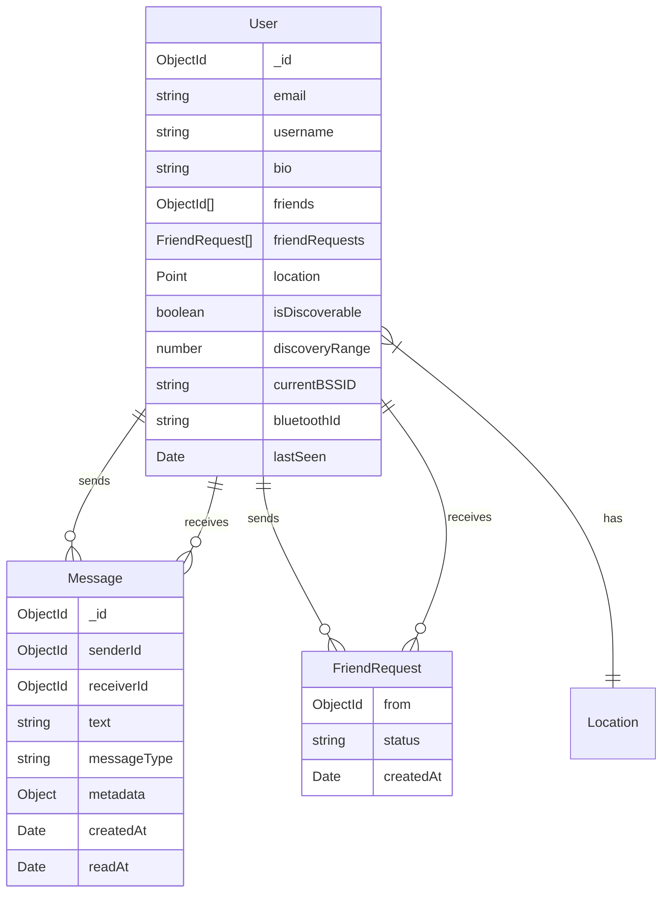
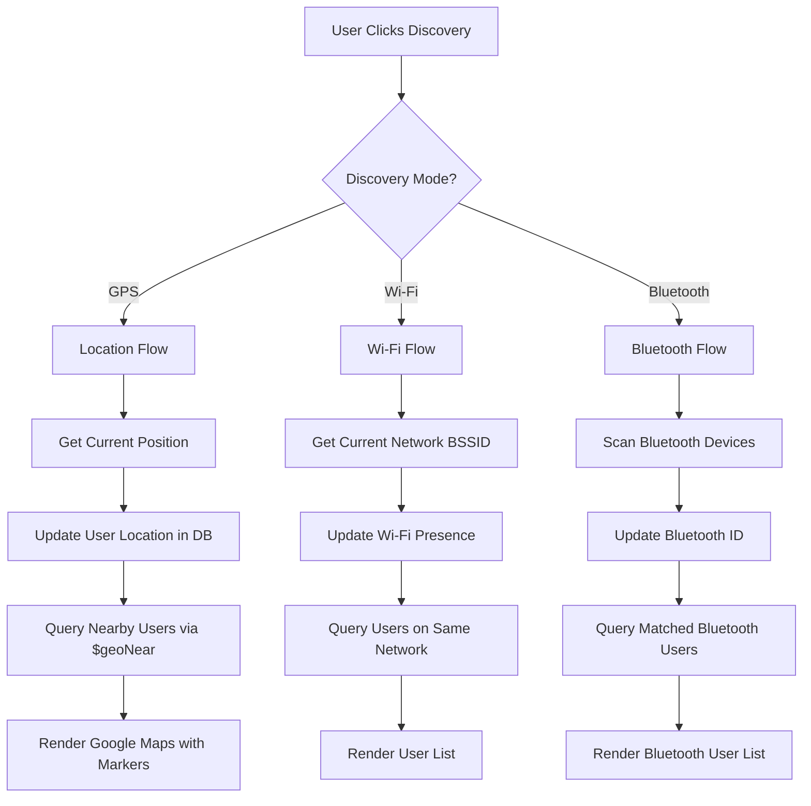
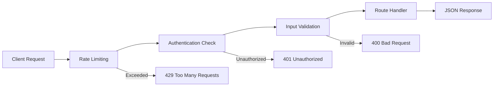

# FriendFinder MVP - Technical Design Document

## Overview

FriendFinder is a mobile-first social networking MVP that enables users to discover nearby people through multiple proximity-based methods and engage in real-time communication. The application focuses on privacy-first discovery with manual trigger mechanisms and provides seamless chat and voice/video calling capabilities.

### Core Value Proposition

- **Multi-Modal Discovery**: Location (GPS + Maps), Wi-Fi network detection, and Bluetooth proximity
- **Privacy-First**: Manual discovery triggers, visibility toggles, and user-controlled presence
- **Real-Time Communication**: WebRTC-powered voice/video calls and instant messaging
- **Mobile-Ready Architecture**: Native abstraction layer for easy React Native migration

## Technology Stack & Dependencies

### Frontend Framework

- **Next.js 15+** with App Router for React Server Components
- **TypeScript** for type safety and developer experience
- **Tailwind CSS** for utility-first styling
- **Shadcn/UI** for consistent component library

### Backend & Database

- **MongoDB with Mongoose** for geospatial queries and flexible document storage
- **NextAuth.js** for authentication (Email + Google OAuth)
- **Socket.io** for real-time communication
- **Cloudinary** for media upload and optimization

### State Management & Validation

- **Zustand** for lightweight global state management
- **Zod** for runtime validation and type inference
- **React Hook Form** with Zod resolver for form management

### Communication & Media

- **WebRTC** for peer-to-peer voice/video calls
- **Socket.io** for real-time messaging and signaling
- **Google Maps API** for location-based discovery visualization

## Architecture

### High-Level System Architecture



### Directory Structure

```
src/
├── app/
│   ├── (auth)/
│   │   ├── login/page.tsx
│   │   └── register/page.tsx
│   ├── dashboard/
│   │   ├── discover/page.tsx
│   │   ├── profile/page.tsx
│   │   ├── chat/page.tsx
│   │   ├── settings/page.tsx
│   │   └── layout.tsx
│   ├── api/
│   │   ├── auth/[...nextauth]/route.ts
│   │   ├── users/
│   │   ├── friends/route.ts
│   │   ├── messages/[userId]/route.ts
│   │   ├── upload/route.ts
│   │   └── socket/route.ts
│   ├── layout.tsx
│   └── page.tsx
├── components/
│   ├── ui/           # Shadcn components
│   ├── dashboard/    # Feature-specific components
│   ├── auth/         # Authentication components
│   └── shared/       # Reusable components
├── contexts/
│   └── AuthContext.tsx
├── hooks/
│   ├── useSocket.ts
│   └── useWebRTC.ts
├── lib/
│   ├── auth.ts
│   ├── mongoose.ts
│   └── validations.ts
├── models/
│   ├── User.ts
│   └── Message.ts
├── services/         # Native abstraction layer
│   ├── api.ts
│   ├── geolocationService.ts
│   ├── wifiService.ts
│   ├── bluetoothService.ts
│   ├── usersService.ts
│   ├── friendsService.ts
│   ├── messagesService.ts
│   └── uploadsService.ts
├── store/
│   ├── userStore.ts
│   ├── discoveryStore.ts
│   ├── chatStore.ts
│   └── callStore.ts
└── types/
    └── index.ts
```

## Component Architecture

### Component Hierarchy & Design Principles



### Component Design Principles

1. **Presentational Components**: All UI components are pure and receive data via props
2. **Server Components First**: Leverage React Server Components for initial data fetching
3. **Client Boundaries**: Mark interactivity boundaries with "use client" directive
4. **Separation of Concerns**: Business logic resides in services and stores, not components

### Key Component Definitions

#### Discovery Components

- **DiscoveryTabs**: Tab interface for GPS/Wi-Fi/Bluetooth modes
- **LocationMap**: Google Maps integration with user markers (GPS mode only)
- **UserList**: Proximity-based user listing (Wi-Fi/Bluetooth modes)
- **DiscoveryButton**: Manual trigger for discovery operations

#### Communication Components

- **ChatWindow**: Message history, input, and typing indicators
- **CallModal**: WebRTC video/audio interface with controls
- **NotificationToast**: Real-time friend request and message notifications

#### Profile Components

- **ProfileForm**: User information editing with validation
- **ImageUpload**: Drag-and-drop profile picture upload
- **PrivacyControls**: Discovery visibility and range settings

## Routing & Navigation

### Route Structure

| Route                 | Type    | Purpose                             | Auth Required |
| --------------------- | ------- | ----------------------------------- | ------------- |
| `/`                   | Landing | App introduction and login redirect | No            |
| `/(auth)/login`       | Client  | Email + Google authentication       | No            |
| `/(auth)/register`    | Client  | User registration form              | No            |
| `/dashboard`          | Server  | Dashboard redirect to discover      | Yes           |
| `/dashboard/discover` | Hybrid  | Multi-modal user discovery          | Yes           |
| `/dashboard/profile`  | Server  | Profile management                  | Yes           |
| `/dashboard/chat`     | Client  | Real-time messaging interface       | Yes           |
| `/dashboard/settings` | Client  | Privacy and app preferences         | Yes           |

### Navigation Architecture



## State Management

### Zustand Store Architecture

#### User Store (`userStore.ts`)

```typescript
interface UserState {
  user: User | null;
  isLoading: boolean;
  updateProfile: (data: ProfileUpdate) => Promise<void>;
  updateLocation: (coords: Coordinates) => Promise<void>;
  setDiscoverability: (visible: boolean) => Promise<void>;
}
```

#### Discovery Store (`discoveryStore.ts`)

```typescript
interface DiscoveryState {
  mode: "gps" | "wifi" | "bluetooth";
  radius: number;
  isDiscoverable: boolean;
  lastResults: NearbyUser[];
  isDiscovering: boolean;
  setMode: (mode: DiscoveryMode) => void;
  triggerDiscovery: () => Promise<void>;
  clearResults: () => void;
}
```

#### Chat Store (`chatStore.ts`)

```typescript
interface ChatState {
  activeThread: string | null;
  messages: Map<string, Message[]>;
  typingUsers: Set<string>;
  unreadCounts: Map<string, number>;
  sendMessage: (userId: string, text: string) => Promise<void>;
  markAsRead: (userId: string) => Promise<void>;
}
```

#### Call Store (`callStore.ts`)

```typescript
interface CallState {
  isInCall: boolean;
  caller: User | null;
  callee: User | null;
  localStream: MediaStream | null;
  remoteStream: MediaStream | null;
  isVideoEnabled: boolean;
  isAudioEnabled: boolean;
  initiateCall: (userId: string, video: boolean) => Promise<void>;
  answerCall: () => Promise<void>;
  endCall: () => void;
}
```

## API Endpoints Reference

### Authentication Endpoints

| Endpoint                  | Method   | Purpose           | Request Schema    | Response Schema |
| ------------------------- | -------- | ----------------- | ----------------- | --------------- |
| `/api/auth/[...nextauth]` | GET/POST | NextAuth handlers | NextAuth standard | Session object  |

### User Management

| Endpoint               | Method | Purpose                  | Request Schema    | Response Schema |
| ---------------------- | ------ | ------------------------ | ----------------- | --------------- |
| `/api/users/me`        | GET    | Get current user profile | None              | `UserProfile`   |
| `/api/users/profile`   | PUT    | Update user profile      | `ProfileUpdate`   | `UserProfile`   |
| `/api/users/location`  | POST   | Update user location     | `LocationUpdate`  | `Success`       |
| `/api/users/presence`  | POST   | Update Wi-Fi presence    | `PresenceUpdate`  | `Success`       |
| `/api/users/bluetooth` | POST   | Update Bluetooth ID      | `BluetoothUpdate` | `Success`       |

### Discovery Endpoints

| Endpoint                      | Method | Purpose                 | Request Schema  | Response Schema |
| ----------------------------- | ------ | ----------------------- | --------------- | --------------- |
| `/api/users/nearby`           | GET    | GPS-based discovery     | Query: `radius` | `NearbyUser[]`  |
| `/api/users/nearby-wifi`      | GET    | Wi-Fi network discovery | None            | `NearbyUser[]`  |
| `/api/users/nearby/bluetooth` | POST   | Bluetooth discovery     | `BluetoothScan` | `NearbyUser[]`  |

### Social Features

| Endpoint       | Method | Purpose             | Request Schema   | Response Schema |
| -------------- | ------ | ------------------- | ---------------- | --------------- |
| `/api/friends` | POST   | Send friend request | `FriendRequest`  | `Success`       |
| `/api/friends` | PUT    | Respond to request  | `FriendResponse` | `Success`       |
| `/api/friends` | GET    | Get friends list    | None             | `Friend[]`      |

### Messaging

| Endpoint                 | Method | Purpose             | Request Schema           | Response Schema |
| ------------------------ | ------ | ------------------- | ------------------------ | --------------- |
| `/api/messages/[userId]` | GET    | Get message history | Query: `limit`, `offset` | `Message[]`     |
| `/api/upload`            | POST   | Upload media files  | `FormData`               | `UploadResult`  |

### Request/Response Schemas

```typescript
// Core data transfer objects
interface UserProfile {
  id: string;
  username: string;
  email: string;
  bio?: string;
  profilePicture?: string;
  isDiscoverable: boolean;
  discoveryRange: number;
  lastSeen: Date;
}

interface NearbyUser {
  id: string;
  username: string;
  profilePicture?: string;
  distance?: number; // meters for GPS
  lastSeen: Date;
  isFriend: boolean;
  hasPendingRequest: boolean;
}

interface LocationUpdate {
  latitude: number;
  longitude: number;
  accuracy?: number;
}

interface Message {
  id: string;
  senderId: string;
  receiverId: string;
  text: string;
  createdAt: Date;
  readAt?: Date;
}
```

## Data Models & ORM Mapping

### User Model

```typescript
// MongoDB schema with Mongoose
interface IUser extends Document {
  // Authentication
  email: string;
  username: string;
  passwordHash?: string;
  googleId?: string;

  // Profile
  bio?: string;
  profilePicture?: string;

  // Social
  friends: ObjectId[];
  friendRequests: {
    from: ObjectId;
    status: "pending" | "accepted" | "rejected";
    createdAt: Date;
  }[];

  // Discovery & Privacy
  isDiscoverable: boolean;
  discoveryRange: number; // meters
  lastSeen: Date;

  // Location (GPS)
  location?: {
    type: "Point";
    coordinates: [number, number]; // [longitude, latitude]
  };

  // Wi-Fi Presence
  currentBSSID?: string;
  lastSeenWiFi?: Date;

  // Bluetooth
  bluetoothId?: string;
  bluetoothIdUpdatedAt?: Date;

  // Timestamps
  createdAt: Date;
  updatedAt: Date;
}

// Indexes for performance
// 1. Geospatial index: location (2dsphere)
// 2. Compound index: currentBSSID + isDiscoverable + lastSeenWiFi
// 3. Single indexes: email, username, googleId
```

### Message Model

```typescript
interface IMessage extends Document {
  senderId: ObjectId;
  receiverId: ObjectId;
  text: string;
  messageType: "text" | "image" | "file";
  metadata?: {
    fileName?: string;
    fileSize?: number;
    mimeType?: string;
    cloudinaryUrl?: string;
  };
  createdAt: Date;
  readAt?: Date;
  editedAt?: Date;
}

// Indexes for message queries
// 1. Compound index: senderId + receiverId + createdAt
// 2. Compound index: receiverId + readAt (for unread queries)
```

### Database Relationships



## Business Logic Layer

### Discovery Service Architecture



### Native Service Abstractions

#### Geolocation Service

```typescript
interface GeolocationService {
  getCurrentPosition(): Promise<{
    latitude: number;
    longitude: number;
    accuracy: number;
  }>;
  checkPermission(): Promise<"granted" | "denied" | "prompt">;
  requestPermission(): Promise<"granted" | "denied">;
}

// Web implementation uses navigator.geolocation
// React Native will use react-native-geolocation-service
```

#### Wi-Fi Service

```typescript
interface WiFiService {
  getNetwork(): Promise<{
    bssid?: string;
    ssid?: string;
    signalStrength?: number;
  }>;
  checkPermission(): Promise<boolean>;
}

// Web implementation returns mock data
// React Native will use react-native-wifi-manager
```

#### Bluetooth Service

```typescript
interface BluetoothService {
  scan(duration: number): Promise<BluetoothDevice[]>;
  checkPermission(): Promise<boolean>;
  generateDeviceId(): string;
}

// Web implementation logs to console
// React Native will use react-native-bluetooth-classic
```

### Privacy & Security Logic

#### Discovery Privacy Rules

1. **User Visibility**: Only discoverable users appear in results
2. **Range Limiting**: GPS discovery respects user-defined radius
3. **Time-based Filtering**: Filter users by recent activity (lastSeen)
4. **Self-exclusion**: User never appears in their own discovery results
5. **Friend Filtering**: Option to show only non-friends in discovery

#### Data Privacy Controls

- **Profile Visibility**: Users control profile information sharing
- **Location Accuracy**: Optionally reduce GPS precision for privacy
- **Presence Timing**: Wi-Fi/Bluetooth presence expires after inactivity
- **Data Retention**: Automatic cleanup of old location/presence data

## Middleware & Interceptors

### API Request Flow



### Middleware Stack

#### 1. Rate Limiting Middleware

```typescript
// Applied to discovery and auth endpoints
const rateLimiter = {
  "/api/users/nearby": "10 requests per minute",
  "/api/users/location": "20 requests per minute",
  "/api/auth/*": "5 requests per minute",
  "/api/friends": "30 requests per minute",
};
```

#### 2. Authentication Middleware

```typescript
// Verifies JWT token and attaches user to request
async function authMiddleware(req: NextRequest) {
  const token = await getToken({ req });
  if (!token) throw new Error("Unauthorized");
  req.user = await getUserById(token.sub);
  return req;
}
```

#### 3. Input Validation Middleware

```typescript
// Validates request body against Zod schemas
function validateInput<T>(schema: ZodSchema<T>) {
  return (req: NextRequest) => {
    const result = schema.safeParse(req.body);
    if (!result.success) {
      throw new ValidationError(result.error);
    }
    req.validatedBody = result.data;
  };
}
```

#### 4. Error Handling Middleware

```typescript
// Standardizes error responses across API
function errorHandler(error: Error) {
  if (error instanceof ValidationError) {
    return Response.json({ error: error.message }, { status: 400 });
  }
  if (error instanceof AuthError) {
    return Response.json({ error: "Unauthorized" }, { status: 401 });
  }
  return Response.json({ error: "Internal Server Error" }, { status: 500 });
}
```

## Testing Strategy

### Unit Testing Approach

#### Service Layer Tests

```typescript
// Example: geolocationService.test.ts
describe("GeolocationService", () => {
  it("should get current position with proper permissions", async () => {
    // Mock navigator.geolocation
    // Test permission checking
    // Verify coordinate accuracy
  });

  it("should handle permission denied gracefully", async () => {
    // Test error handling
    // Verify fallback behavior
  });
});
```

#### Store Tests

```typescript
// Example: discoveryStore.test.ts
describe("DiscoveryStore", () => {
  it("should update discovery mode and clear previous results", () => {
    // Test state transitions
    // Verify side effects
  });

  it("should handle discovery errors without breaking state", async () => {
    // Test error boundaries
    // Verify recovery mechanisms
  });
});
```

### Integration Testing

#### API Endpoint Tests

```typescript
// Example: nearby users API test
describe("/api/users/nearby", () => {
  it("should return nearby users within specified radius", async () => {
    // Seed test users with locations
    // Make authenticated request
    // Verify response format and data
    // Check distance calculations
  });

  it("should respect user privacy settings", async () => {
    // Test isDiscoverable filtering
    // Verify range limitations
  });
});
```

#### WebRTC Integration Tests

```typescript
describe("WebRTC Call Flow", () => {
  it("should establish peer connection and exchange media", async () => {
    // Mock WebRTC APIs
    // Test signaling flow
    // Verify media stream handling
  });
});
```

### End-to-End Testing

#### Critical User Journeys

1. **Registration → Profile Setup → Discovery → Friend Request**
2. **Login → GPS Discovery → Add Friend → Start Chat**
3. **Wi-Fi Discovery → Send Message → Voice Call**
4. **Privacy Settings → Location Update → Bluetooth Discovery**

#### Test Environment Setup

- **Database**: MongoDB in-memory for isolation
- **Authentication**: Mock NextAuth sessions
- **External APIs**: Mock Google Maps and Cloudinary
- **WebRTC**: Mock peer connections and media streams
